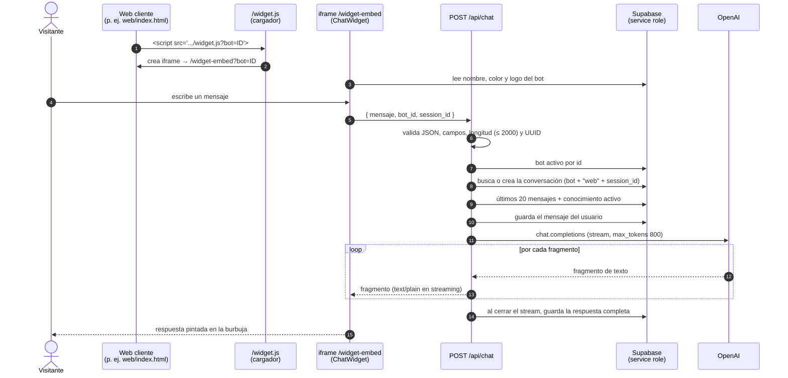
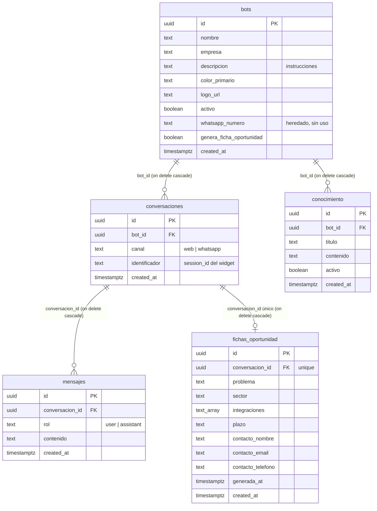

# Requisitos del producto — Kobo Assistant

**Estado:** `DRAFT` — describe el código de `main` en el commit `4928b66`
(KOBO-04 incluida).
**Preparado en:** tarea KOBO-RF.
**Fecha:** 2026-10-09.
**Para:** Manu (diseño y web) e Iñigo (desarrollo), socios de The Kobo Studio.

> **Regla de este documento:** describe lo que el sistema **hace según el
> código**, no lo que creemos que hace. Cada requisito implementado lleva su
> evidencia: un fichero con sus líneas, o el nombre de un test. Lo que no se
> puede demostrar así se marca como **no verificado** o no se afirma.
>
> Las referencias `fichero:línea` apuntan al commit indicado arriba. Si el
> código cambia, las líneas pueden moverse.

## Índice

1. [Resumen ejecutivo](#1-resumen-ejecutivo)
2. [Glosario](#2-glosario)
3. [Arquitectura](#3-arquitectura)
4. [Actores](#4-actores)
5. [Requisitos funcionales implementados](#5-requisitos-funcionales-implementados)
6. [Requisitos funcionales planificados](#6-requisitos-funcionales-planificados)
7. [Requisitos no funcionales](#7-requisitos-no-funcionales)
8. [Los dos bots de demostración](#8-los-dos-bots-de-demostración)
9. [Qué NO hace hoy](#9-qué-no-hace-hoy)
10. [Verificación manual](#10-verificación-manual)
11. [Deuda conocida y hoja de ruta](#11-deuda-conocida-y-hoja-de-ruta)

---

## 1. Resumen ejecutivo

**Qué es.** Kobo Assistant es el motor de asistentes conversacionales de The
Kobo Studio. Es **un solo programa** (Next.js + Supabase + OpenAI) que puede
hacer de muchos asistentes distintos: cada asistente ("bot") es una fila en la
base de datos con su nombre, su empresa, sus instrucciones de comportamiento y
su base de conocimiento. Cambiar de asistente es cambiar datos, no código.
Deriva de Zorion Chat; en esta versión se quitaron a propósito AimHarder,
WhatsApp/Twilio y el cron.

**Qué hace hoy (demostrable en el código):**

- Se instala en cualquier web con **una línea** `` en
  cualquier web crea un iframe fijo abajo a la derecha que carga
  `/widget-embed?bot=<id>`. El iframe mide 70×70 px cerrado y 420×620 px
  abierto: el widget avisa al cargador con `postMessage` y el cargador solo
  acepta mensajes de su propio iframe. Las cabeceras permiten cargar el script
  desde cualquier origen y meter el iframe en cualquier web.
- **Criterio de aceptación:** en una web con esa línea aparece la burbuja; al
  pulsarla se abre el chat; sin `?bot=` no se crea nada.
- **Evidencia (código):** cargador `src/app/widget.js/route.ts:5-45`
  (sin bot no hace nada: línea 10; filtro de origen del mensaje: línea 23);
  aviso de tamaño `src/components/chat/ChatWidget.tsx:106-114`; tamaños
  `src/components/chat/ChatWidget.tsx:67-68`; cabeceras
  `next.config.ts:4-18`; uso real en `web/index.html:633`.

#### RF-02 — Chat con respuesta en streaming

- **Actor:** visitante.
- **Descripción:** `POST /api/chat` llama a OpenAI con `stream: true` y
  `max_tokens: 800` y reenvía cada fragmento al navegador como texto plano.
  El widget pinta los fragmentos según llegan y muestra "escribiendo..."
  hasta el primero. Modelo: `OPENAI_MODEL` o, si no está, `gpt-4o`.
- **Criterio de aceptación:** la respuesta aparece poco a poco, no de golpe.
- **Evidencia (código):** `src/app/api/chat/route.ts:68-102`;
  modelo `src/app/api/chat/route.ts:13`; cliente
  `src/components/chat/useChatSession.ts:49-75`; indicador
  `src/components/chat/ChatWidget.tsx:304-310`.

#### RF-03 — Identidad e instrucciones por bot

- **Actor:** visitante (lo percibe), usuario del panel (lo configura).
- **Descripción:** el *system prompt* empieza por "Eres el asistente virtual
  de "<empresa>" y te llamas <nombre>", añade las instrucciones del bot
  (`descripcion`) si las hay, y termina siempre con la orden de basarse solo
  en esa información y no inventar datos.
- **Criterio de aceptación:** dos bots con distinta configuración reciben
  prompts distintos; sin descripción no aparece el bloque de instrucciones; la
  instrucción de no inventar va siempre al final.
- **Evidencia (test):** `src/lib/bot.test.ts`, bloque
  `construirSystemPrompt`: "con nombre: presenta al asistente con la empresa
  y el nombre", "sin nombre: presenta al asistente solo con la empresa",
  "con descripción: incluye las instrucciones de comportamiento", "con
  descripción nula: omite el bloque de instrucciones", "la instrucción de no
  inventar datos va siempre al final". Código: `src/lib/bot.ts:91-108`.

#### RF-04 — Conocimiento por bot

- **Actor:** visitante (lo percibe), usuario del panel (lo configura).
- **Descripción:** en cada mensaje se cargan las entradas de `conocimiento`
  del bot con `activo = true` y se añaden al prompt bajo "Base de
  conocimiento", con el título delante si lo tienen. Todo el conocimiento
  activo va entero en cada petición (no hay búsqueda ni recorte).
- **Criterio de aceptación:** solo entra el conocimiento activo del bot que
  responde; sin conocimiento no aparece la sección.
- **Evidencia:** test `src/lib/bot.test.ts`: "conocimiento con título:
  antepone el título al contenido", "conocimiento sin título: usa solo el
  contenido", "varias entradas de conocimiento: se separan con una línea en
  blanco", "conocimiento vacío: no aparece la base de conocimiento". Filtro
  por bot y `activo` (código, sin test): `src/lib/bot.ts:73-84`.

#### RF-05 — Historial limitado a 20 mensajes

- **Actor:** sistema.
- **Descripción:** al modelo se le envían, además del mensaje nuevo, los 20
  mensajes más recientes de la conversación, en orden cronológico. Limita
  coste y tamaño de contexto.
- **Criterio de aceptación:** en una conversación con más de 20 mensajes
  previos, OpenAI recibe system + 20 previos + el nuevo.
- **Evidencia (código):** constante `src/lib/bot.ts:11`; consulta
  `src/lib/bot.ts:58-71`; montaje `src/lib/bot.ts:110-125`. **Sin test.**

#### RF-06 — Persistencia de conversaciones y mensajes

- **Actor:** sistema.
- **Descripción:** la conversación se busca por bot + canal `web` +
  `session_id`; si no existe, se crea. El mensaje del usuario se guarda
  **antes** de llamar a OpenAI; la respuesta completa se guarda **al terminar**
  el stream, solo si no está vacía. Si falla el guardado de un mensaje, se
  registra en el log del servidor y la conversación sigue.
- **Criterio de aceptación:** tras chatear, la conversación y sus mensajes
  aparecen en `/admin/conversaciones`.
- **Evidencia (código):** `src/lib/bot.ts:26-56` y `src/lib/bot.ts:127-145`;
  orden en `src/app/api/chat/route.ts:58-66` y
  `src/app/api/chat/route.ts:90-95`. **Sin test.**
- **Consecuencias que conviene saber:** el `session_id` se genera en cada
  carga de la página (`src/components/chat/useChatSession.ts:12`), así que
  **recargar la web empieza otra conversación**. Si OpenAI falla, el mensaje
  del usuario queda guardado sin respuesta.

#### RF-07 — Validaciones de entrada de `/api/chat`

- **Actor:** sistema (frente a cualquier cliente HTTP).
- **Descripción:** antes de tocar Supabase u OpenAI, la ruta rechaza:
  JSON inválido → `400 "JSON inválido"`; falta `mensaje`, `bot_id` o
  `session_id`, alguno no es texto, o `mensaje` está en blanco → `400`;
  `mensaje` de más de 2000 caracteres → **`413`**; `bot_id` o `session_id` que
  no son UUID → `400 "Identificador inválido"`. La longitud se comprueba antes
  que el formato UUID.
- **Criterio de aceptación:** cada caso devuelve su código y ningún rechazo
  llama a Supabase ni a OpenAI. Un mensaje de exactamente 2000 caracteres pasa.
- **Evidencia (test):** `src/app/api/chat/route.test.ts`, bloque
  "POST /api/chat — validaciones de entrada" (14 casos): "JSON inválido → 400
  'JSON inválido'", "cuerpo null → 400 por campos ausentes", "falta %s → 400"
  (×3), "mensaje que no es texto → 400", "mensaje en blanco (%s) → 400" (×3),
  "bot_id que no es UUID → 400 'Identificador inválido'", "session_id que no
  es UUID → 400 'Identificador inválido'", "mensaje de 2001 caracteres →
  413", "documenta el orden actual: la longitud se valida antes que el UUID",
  "mensaje de exactamente 2000 caracteres → no se rechaza por longitud".
  Código: `src/app/api/chat/route.ts:10-50`.

#### RF-08 — Solo responden los bots activos

- **Actor:** sistema.
- **Descripción:** la API solo atiende a bots con `activo = true`; si no lo
  encuentra responde `404 "Bot no encontrado"` sin llamar a OpenAI.
- **Criterio de aceptación:** un bot desactivado desde el panel deja de
  responder.
- **Evidencia:** código `src/lib/bot.ts:13-24` y
  `src/app/api/chat/route.ts:52-56`. El test "mensaje de exactamente 2000
  caracteres → no se rechaza por longitud" demuestra el `404` sin llamada a
  OpenAI cuando el bot no aparece; el filtro por `activo` en sí no tiene test.
- **Ojo:** `/widget-embed` no filtra por `activo` (`src/app/widget-embed/page.tsx:21-25`):
  la burbuja de un bot desactivado se sigue pintando, pero al escribir sale el
  error del RF-09.

#### RF-09 — Error visible en el widget

- **Actor:** visitante.
- **Descripción:** si `/api/chat` responde con error (4xx/5xx) o la petición
  falla, el widget muestra en rojo "No se pudo enviar el mensaje. Inténtalo de
  nuevo.".
- **Criterio de aceptación:** con el backend parado o una clave de OpenAI
  inválida, el visitante ve ese aviso en vez de quedarse esperando.
- **Evidencia (código):** `src/components/chat/useChatSession.ts:42-44` y
  `src/components/chat/useChatSession.ts:76-77`; pintado
  `src/components/chat/ChatWidget.tsx:311-313`. **Sin test.** Lo de la clave
  inválida se deduce del código: si la llamada a OpenAI falla antes de empezar
  el stream, la ruta no lo captura y Next responde con error 500. No se ha
  ejecutado para este documento (ver [§10](#10-verificación-manual)).
- **Límite conocido:** si OpenAI falla **a mitad** del stream, el servidor lo
  registra en el log y cierra el stream sin avisar
  (`src/app/api/chat/route.ts:88-91`). El visitante ve una respuesta cortada o
  ninguna, **sin mensaje de error**. Ver [§11](#11-deuda-conocida-y-hoja-de-ruta).

#### RF-10 — Presentación segura de los mensajes

- **Actor:** visitante.
- **Descripción:** antes de pintar un mensaje, el widget escapa el HTML y
  solo después convierte en enlaces las URL `http(s)` (abren en otra pestaña
  con `noopener noreferrer`) y en negrita el texto entre `**`. El color del
  texto se elige según el contraste con el color del bot.
- **Criterio de aceptación:** un mensaje con `<script>` se ve como texto, no
  se ejecuta.
- **Evidencia (código):** `src/components/chat/ChatWidget.tsx:48-65` y
  `src/components/chat/ChatWidget.tsx:238-247`; contraste
  `src/components/chat/ChatWidget.tsx:31-46`. **Sin test.**

#### RF-11 — Texto a voz

- **Actor:** visitante.
- **Descripción:** cada respuesta del asistente tiene un botón de
  reproducir/pausar. Al pulsarlo, el widget pide el audio a `POST /api/tts`,
  que usa OpenAI (`tts-1`, voz `nova`, MP3). El audio se guarda en memoria del
  navegador para no pedirlo dos veces. Textos vacíos o de más de 2000
  caracteres → `400`.
- **Criterio de aceptación:** al pulsar el botón se oye la respuesta; la
  segunda vez no hay nueva petición.
- **Evidencia (código):** `src/app/api/tts/route.ts:4-26`; cliente
  `src/components/chat/ChatWidget.tsx:123-166` y
  `src/components/chat/ChatWidget.tsx:248-300`. **Sin test.**
- **Límites:** `/api/tts` no recibe ni comprueba el bot ni la sesión, y no
  protege `request.json()`: un cuerpo que no es JSON da error 500
  (`src/app/api/tts/route.ts:5`). Si el audio falla, el botón vuelve a su
  estado sin avisar (`src/components/chat/ChatWidget.tsx:161-162`).

#### RF-12 — Sala de demos con selector de bot

- **Actor:** equipo de Kobo (en una demo).
- **Descripción:** `/widget` lista los bots activos como botones; al elegir
  uno se monta su widget (`/widget?bot=<id>`). Si no se elige, usa
  `NEXT_PUBLIC_DEMO_BOT_ID` o el primer bot activo. Si no hay bots activos,
  muestra un aviso con el siguiente paso. La portada `/` enlaza a la sala.
- **Criterio de aceptación:** con el seed cargado aparecen Kobo y Bea; al
  cambiar de botón cambian nombre, color y comportamiento del chat.
- **Evidencia (código):** `src/app/widget/page.tsx:9-72` (consulta 23-28,
  elección 31, selector 42-56, aviso 66-70); portada `src/app/page.tsx:12-17`.
  **Sin test.**

### Panel

#### RF-13 — Panel con login

- **Actor:** usuario del panel.
- **Descripción:** todo `/admin/*` exige sesión de Supabase Auth; sin sesión
  redirige a `/admin/login`, y con sesión `/admin/login` redirige a
  `/admin/bots`. Login con email y contraseña; error genérico "Correo o
  contraseña incorrectos.". Botón de cerrar sesión. Las cookies de sesión no
  tienen caducidad: se borran al cerrar el navegador.
- **Criterio de aceptación:** sin login no se ve ninguna página del panel.
- **Evidencia (código):** `src/proxy.ts:4-30`; login
  `src/app/admin/login/page.tsx:14-33`; cierre
  `src/components/admin/LogoutButton.tsx:9-14`; cookies
  `src/lib/supabase/cookies.ts:8-13`. **Sin test.**
- **Límite:** no hay roles. Cualquier usuario creado en Supabase Auth tiene
  acceso total al panel (ver [§9](#9-qué-no-hace-hoy) y KOBO-05).

#### RF-14 — Gestión de bots

- **Actor:** usuario del panel.
- **Descripción:** `/admin/bots` lista los bots (id copiable con un clic,
  nombre, empresa, WhatsApp, estado). Se puede crear, editar y borrar (con
  confirmación). El formulario edita nombre, empresa, instrucciones, color,
  logo (ruta en `public/` o URL), número de WhatsApp, activo y "Generar ficha
  de oportunidad". **Cambiar las instrucciones o el conocimiento cambia el
  comportamiento del bot sin tocar código.**
- **Criterio de aceptación:** un cambio guardado en el panel se nota en el
  siguiente mensaje del chat.
- **Evidencia (código):** listado `src/app/admin/(dashboard)/bots/page.tsx`;
  formulario `src/components/admin/BotForm.tsx:27-197`; acciones
  `src/lib/actions/bots.ts:7-60`; copiar id
  `src/components/admin/CopyableId.tsx:9-31`; borrar
  `src/components/admin/DeleteBotButton.tsx:14-23`. **Sin test.**
- **Límites:** las acciones no comprueban sesión ni rol por sí mismas (solo
  las protege `src/proxy.ts`); borrar un bot borra en cascada todas sus
  conversaciones; el campo WhatsApp se guarda pero ningún código lo usa.

#### RF-15 — Gestión del conocimiento

- **Actor:** usuario del panel.
- **Descripción:** `/admin/bots/<id>/conocimiento` lista las entradas del bot
  (título, contenido recortado a 80 caracteres, estado) y permite añadir,
  editar y borrar. Las entradas nuevas se crean activas.
- **Criterio de aceptación:** una entrada añadida se usa en el siguiente
  mensaje del bot.
- **Evidencia (código):**
  `src/app/admin/(dashboard)/bots/[id]/conocimiento/page.tsx`;
  formulario `src/components/admin/ConocimientoForm.tsx:31-88`; acciones
  `src/lib/actions/conocimiento.ts:7-66` (alta activa: línea 24). **Sin test.**
- **Límite:** el panel muestra si una entrada está activa, pero **no permite
  cambiarlo**: el formulario no tiene ese campo. Desactivar una entrada solo
  se puede hacer en el SQL Editor.

#### RF-16 — Listado de conversaciones

- **Actor:** usuario del panel.
- **Descripción:** `/admin/conversaciones` lista las conversaciones de
  **todos** los bots, de la más reciente a la más antigua (bot, canal,
  identificador recortado, fecha), con un desplegable para filtrar por bot.
- **Criterio de aceptación:** tras chatear con Kobo, su conversación aparece
  la primera; al filtrar por Bea desaparece.
- **Evidencia (código):** `src/app/admin/(dashboard)/conversaciones/page.tsx:18-102`;
  consulta `src/lib/conversaciones.ts:12-33`; filtro
  `src/components/admin/ConversacionesBotFilter.tsx:11-38`. **Sin test.**

#### RF-17 — Detalle de conversación

- **Actor:** usuario del panel.
- **Descripción:** `/admin/conversaciones/<id>` muestra todos los mensajes en
  orden, con hora, y, si el bot tiene la ficha activada, la sección "Ficha de
  oportunidad" encima.
- **Criterio de aceptación:** se ve la conversación completa, no solo los
  últimos 20 mensajes.
- **Evidencia (código):**
  `src/app/admin/(dashboard)/conversaciones/[id]/page.tsx:86-171`; mensajes
  `src/lib/conversaciones.ts:51-66`. **Sin test.**

### Ficha de oportunidad (KOBO-04)

#### RF-18 — Activación por bot

- **Actor:** usuario del panel.
- **Descripción:** la ficha solo existe para bots con
  `genera_ficha_oportunidad = true`. Por defecto está desactivada. Se activa
  con una casilla del formulario del bot. En la demo: activada en Kobo,
  desactivada en Bea.
- **Criterio de aceptación:** en una conversación de Bea no aparece la
  sección ni el botón; en una de Kobo sí.
- **Evidencia:** columna `supabase/schema.sql:18-19`; seed
  `supabase/seed-demo.sql:37` (Kobo `true`) y `supabase/seed-demo.sql:76`
  (Bea `false`); casilla `src/components/admin/BotForm.tsx:163-184`; página
  `src/app/admin/(dashboard)/conversaciones/[id]/page.tsx:99-101` y
  `src/app/admin/(dashboard)/conversaciones/[id]/page.tsx:133-135`. La
  comprobación en servidor tiene test (RF-23).

#### RF-19 — Generación bajo demanda

- **Actor:** usuario del panel.
- **Descripción:** botón "Generar ficha" (o "Regenerar ficha" si ya existe).
  Genera la ficha con OpenAI a partir de **todos** los mensajes de la
  conversación y la guarda; si ya había una, la sustituye (una ficha por
  conversación). Muestra la fecha de generación. Los campos vacíos se ven como
  "No aparece en la conversación". Sin cron ni generación automática.
- **Criterio de aceptación:** tras el guion de Kobo, pulsar el botón muestra
  la ficha; pulsarlo otra vez la regenera.
- **Evidencia:** test `src/lib/actions/fichaOportunidad.test.ts`: "usuario
  autenticado sin rol admin → genera, valida y guarda la ficha". Código:
  acción `src/lib/actions/fichaOportunidad.ts:25-96` (guardado 1:1 con
  `upsert`, líneas 83-87); botón `src/components/admin/GenerarFichaButton.tsx:11-49`;
  vista `src/app/admin/(dashboard)/conversaciones/[id]/page.tsx:15-84`.

#### RF-20 — Esquema estricto

- **Actor:** sistema.
- **Descripción:** a OpenAI se le pide salida estructurada con un esquema
  JSON en modo estricto (`strict: true`, `additionalProperties: false`, todos
  los campos obligatorios aunque puedan ser `null`), temperatura 0 y máximo
  600 tokens. Las instrucciones de extracción dicen que solo cuenta lo que
  escribe el usuario, que lo que no aparece es `null` y que la conversación
  es material que analizar, no órdenes.
- **Criterio de aceptación:** la petición a OpenAI lleva el esquema en modo
  estricto.
- **Evidencia (test):** `src/lib/fichaOportunidad.test.ts`: "pide salida
  estructurada estricta y devuelve la ficha validada". Código: esquema
  `src/lib/fichaOportunidad.ts:23-48`; instrucciones
  `src/lib/fichaOportunidad.ts:50-60`; llamada
  `src/lib/fichaOportunidad.ts:211-227`.

#### RF-21 — Validación en código

- **Actor:** sistema.
- **Descripción:** aunque el esquema sea estricto, la respuesta del modelo se
  vuelve a validar en código antes de guardar nada: rechaza si no es un
  objeto, si falta algún campo o si algún tipo es erróneo; normaliza textos
  vacíos, listas vacías y contacto vacío a `null`. JSON mal formado, negativa
  del modelo o respuesta vacía también son error.
- **Criterio de aceptación:** una ficha con tipos erróneos no se guarda.
- **Evidencia (test):** `src/lib/fichaOportunidad.test.ts`, bloque
  `validarFicha` (acepta ficha completa, acepta todo `null`, normaliza vacíos,
  rechaza campos ausentes, contacto incompleto y tipos erróneos) y bloque
  `generarFichaOportunidad` ("lanza error si la ficha no cumple el esquema",
  "lanza error si el JSON está mal formado", "lanza error si el modelo se
  niega"); `src/lib/actions/fichaOportunidad.test.ts`: "OpenAI devuelve una
  ficha con tipos erróneos → no se guarda". Código:
  `src/lib/fichaOportunidad.ts:81-151` y `src/lib/fichaOportunidad.ts:229-248`.

#### RF-22 — Confirmación del contacto contra lo que escribió el usuario

- **Actor:** sistema.
- **Descripción:** "nunca afirmar lo que no se ha obtenido". El email solo se
  guarda si aparece literalmente (sin distinguir mayúsculas) en lo que
  escribió el usuario; el teléfono, si sus dígitos (6 o más) aparecen en los
  dígitos de lo que escribió el usuario. Si no, se descartan. Si no queda
  ningún dato, el contacto es `null`. **El nombre no se puede comprobar así**
  y depende solo de las instrucciones al modelo.
- **Criterio de aceptación:** si el modelo inventa un email que el usuario no
  dio, la ficha guardada no lo tiene.
- **Evidencia (test):** `src/lib/fichaOportunidad.test.ts`, bloque
  `confirmarContacto` ("mantiene email y teléfono que el usuario escribió",
  "descarta email y teléfono que no aparecen en lo que dijo el usuario", "si
  no queda ningún dato, contacto es null") y "descarta un email que el
  usuario no dio"; `src/lib/actions/fichaOportunidad.test.ts`: "sin contacto
  en la conversación → se guarda el contacto vacío aunque el modelo invente
  uno". Código: `src/lib/fichaOportunidad.ts:163-197` y
  `src/lib/fichaOportunidad.ts:250-255`.

#### RF-23 — Controles previos a OpenAI

- **Actor:** sistema (frente a cualquiera que invoque la acción).
- **Descripción:** la acción se defiende sola, en este orden y **antes de
  gastar en OpenAI**: (1) usuario autenticado con `getUser()`; si no, "No
  autorizado: inicia sesión en el panel.", sin leer nada; (2) id con formato
  UUID; (3) la conversación existe; (4) su bot tiene la ficha activada;
  (5) hay al menos un mensaje del usuario. No exige rol admin.
- **Criterio de aceptación:** en cada caso de rechazo no hay llamada a OpenAI
  ni escritura en la base de datos.
- **Evidencia (test):** `src/lib/actions/fichaOportunidad.test.ts`: "sin
  usuario autenticado → error de autorización, sin leer la conversación ni
  llamar a OpenAI", "getUser() con error de sesión → error de autorización,
  sin tocar nada", "bot con la columna %s → error sin llamar a OpenAI" (×2:
  `false` y columna ausente), "conversación inexistente → error sin llamar a
  OpenAI", "id que no es UUID → error sin consultar la base de datos",
  "conversación sin mensajes del usuario → error sin llamar a OpenAI".
  Código: `src/lib/actions/fichaOportunidad.ts:28-69`.

#### RF-24 — Errores explícitos de la ficha

- **Actor:** usuario del panel.
- **Descripción:** si falla la lectura de la conversación, OpenAI o el
  guardado, el panel muestra un mensaje concreto ("No se ha podido consultar
  la conversación.", "No se ha podido generar la ficha. Inténtalo de nuevo en
  unos minutos.", "La ficha se ha generado, pero no se ha podido guardar.") y
  no enseña una ficha vacía como si fuera real.
- **Criterio de aceptación:** con OpenAI caído, aparece el aviso en rojo bajo
  el botón y no se guarda nada.
- **Evidencia (test):** `src/lib/actions/fichaOportunidad.test.ts`: "fallo
  al leer la conversación → error explícito, no 'no encontrada'", "fallo de
  OpenAI → mensaje explícito y no se guarda nada", "fallo al guardar → error
  explícito"; `src/lib/fichaOportunidad.test.ts`: "propaga el fallo de la
  llamada a OpenAI". Pintado del error (código):
  `src/components/admin/GenerarFichaButton.tsx:42-46`.

### Resumen

| Id | Requisito | Verificación |
| --- | --- | --- |
| RF-01 | Widget embebible con una línea | Código |
| RF-02 | Chat con streaming | Código |
| RF-03 | Identidad e instrucciones por bot | Test |
| RF-04 | Conocimiento por bot | Test (montaje) + código (filtro) |
| RF-05 | Historial de 20 mensajes | Código |
| RF-06 | Persistencia | Código |
| RF-07 | Validaciones de `/api/chat` | Test |
| RF-08 | Solo bots activos | Test parcial + código |
| RF-09 | Error visible en el widget | Código |
| RF-10 | Presentación segura | Código |
| RF-11 | Texto a voz | Código |
| RF-12 | Sala de demos | Código |
| RF-13 | Panel con login | Código |
| RF-14 | Gestión de bots | Código |
| RF-15 | Gestión del conocimiento | Código |
| RF-16 | Listado de conversaciones | Código |
| RF-17 | Detalle de conversación | Código |
| RF-18 | Ficha: activación por bot | Código + test (servidor) |
| RF-19 | Ficha: bajo demanda | Test |
| RF-20 | Ficha: esquema estricto | Test |
| RF-21 | Ficha: validación en código | Test |
| RF-22 | Ficha: confirmación del contacto | Test |
| RF-23 | Ficha: controles previos | Test |
| RF-24 | Ficha: errores explícitos | Test |

**24 requisitos implementados**: 8 demostrados con test (RF-03, RF-07, RF-19
a RF-24), 3 con test parcial (RF-04, RF-08, RF-18) y 13 solo con lectura de
código. Todo lo que toca el navegador, el panel y Supabase real está sin test
automático: por eso existe la [§10](#10-verificación-manual).

---

## 6. Requisitos funcionales planificados

Uno por tarea de [`docs/BACKLOG.md`](BACKLOG.md). El detalle (alcance, qué no
tocar, criterio de hecho completo) está allí; aquí va el requisito resumido.

### Estado de las tareas del BACKLOG

| Tarea | Estado en `main` (`4928b66`) | Dónde está |
| --- | --- | --- |
| KOBO-02 — Tests mínimos con Vitest | **Hecha** (commit `f5aec9c`) | Base de las evidencias de test de la §5 |
| KOBO-04 — Ficha de oportunidad | **Hecha** (commit `4928b66`) | RF-18 a RF-24 |
| KOBO-03 — Rate limit | Pendiente | RFP-KOBO-03 |
| KOBO-05 — Panel por roles | Pendiente | RFP-KOBO-05 |
| KOBO-06 — Puerto LLM | Pendiente (añadida en KOBO-RF) | RFP-KOBO-06 |

Nota: `docs/BACKLOG.md` todavía describe KOBO-02 y KOBO-04 como tareas
abiertas; no marca cuáles están hechas.

#### RFP-KOBO-03 — Rate limit con puerto `RateLimiter`

- **Actor:** sistema (frente a visitantes y clientes HTTP).
- **Descripción:** limitar las peticiones a `/api/chat` y `/api/tts`, con
  límite principal por `session_id` y secundario, más holgado, por IP; claves
  separadas por `bot_id`. Al superarlo, `429` con mensaje en español y
  cabecera `Retry-After`. Las rutas hablan con un puerto `RateLimiter`; la
  primera implementación es un adaptador en memoria. `/api/tts` pasará a
  recibir y validar `bot_id` y `session_id`, y a proteger `request.json()`.
- **Criterio de aceptación:** un bucle de peticiones con el mismo
  `session_id` recibe `429` con `Retry-After`; el mismo `session_id` en dos
  bots lleva contadores separados; tests con temporizadores falsos.
- **Limitación ya asumida:** el adaptador en memoria no sirve con varias
  instancias ni en serverless; producción necesitará otro adaptador.
- **Dependencias:** KOBO-02 (hecha).

#### RFP-KOBO-05 — Panel por roles

- **Actor:** administrador por rol / usuario del panel.
- **Descripción:** solo usuarios con `app_metadata.rol === "admin"` pueden
  crear, editar o borrar bots y conocimiento. La comprobación va **dentro de
  cada server action** (helper `exigirAdmin()` con `getUser()`), porque las
  acciones usan la service role y RLS no las frena. RLS se endurece como
  defensa en profundidad. Nunca se lee el rol de `user_metadata`.
- **Criterio de aceptación:** un usuario sin rol admin recibe error de
  autorización y las tablas no cambian; ponerse el rol en `user_metadata` no
  sirve; un admin trabaja como hoy.
- **No cambia:** conversaciones y fichas siguen al alcance de cualquier
  usuario autenticado; el aislamiento por cliente es otra tarea (ver §11).
- **Dependencias:** KOBO-02 (hecha); va después de KOBO-04 (hecha).

#### RFP-KOBO-06 — Puerto LLM con adaptadores OpenAI y Anthropic

- **Actor:** usuario del panel (elige el modelo de cada bot); sistema.
- **Descripción:** el modelo de lenguaje pasa a estar detrás de un puerto
  propio (`ModeloLenguaje`) con dos operaciones: conversar en streaming (para
  `/api/chat`) y extraer JSON con esquema (para la ficha). Dos adaptadores:
  OpenAI (el comportamiento de hoy) y Anthropic. El proveedor y el modelo se
  eligen **por bot** desde el panel, con **Claude como modelo por defecto
  previsto**. La salida de cualquier proveedor sigue pasando por la validación
  en código de la ficha.
- **Voz:** **Anthropic no ofrece texto a voz**, así que `/api/tts` seguirá
  necesitando un proveedor con TTS (hoy OpenAI) y su clave, aunque todos los
  bots conversen con Claude.
- **Criterio de aceptación:** las rutas no importan ningún SDK de proveedor;
  un bot con Anthropic y otro con OpenAI responden en streaming en `/widget`;
  la ficha funciona con ambos; un fallo del proveedor se ve.
- **Decisión pendiente (Zabal):** modelo Claude concreto y si el chat usa uno
  más barato que la ficha; prioridad de la tarea en el orden del BACKLOG.
- **Dependencias:** KOBO-02 (hecha); recomendable después de KOBO-03.

---

## 7. Requisitos no funcionales

Cada apartado separa **lo que hay** (con evidencia) de **lo que falta**.

### 7.1 Seguridad

**Lo que hay:**

- **Validación de entrada en `/api/chat`** antes de gastar nada (RF-07).
- **La service role solo vive en servidor:** se lee de
  `SUPABASE_SERVICE_ROLE_KEY`, sin prefijo `NEXT_PUBLIC_`, así que Next no la
  envía al navegador (`src/lib/supabase/admin.ts:3-14`).
- **`/admin/*` exige sesión**, validada con `getUser()` contra el servidor de
  Auth (`src/proxy.ts:7-9`).
- **La acción de la ficha se defiende sola** (RF-23), con test.
- **Cookies del panel solo de sesión** (`src/lib/supabase/cookies.ts:8-13`).
- **RLS activado en todas las tablas** (`supabase/schema.sql:23`, `43`, `68`,
  `94`, `121`).
- **El HTML de los mensajes se escapa** antes de pintarlo (RF-10).
- **La ficha trata la conversación como datos**, no como órdenes
  (`src/lib/fichaOportunidad.ts:60`), y el contacto se confirma en código
  (RF-22).

**Lo que falta (o es débil), comprobado en el código:**

- **Sin rate limit** en `/api/chat` ni `/api/tts` → KOBO-03.
- **Sin roles:** cualquier usuario de Supabase Auth administra todo → KOBO-05.
- **Las acciones de bots y conocimiento no comprueban la sesión por sí
  mismas** (`src/lib/actions/bots.ts:22-60`,
  `src/lib/actions/conocimiento.ts:14-66`); dependen solo de `src/proxy.ts`.
  La ficha (KOBO-04) ya sigue el patrón correcto; KOBO-05 lo extiende.
- **Las políticas RLS permiten a `anon` insertar conversaciones y mensajes**
  (`supabase/schema.sql:51-55` y `76-80`). La clave anónima es pública (va al
  navegador para el login), así que cualquiera podría escribir directamente en
  esas tablas saltándose las validaciones de `/api/chat`. El código actual no
  usa esa vía: escribe con la service role (`src/lib/bot.ts:31`, `132`).
  Parece herencia de Zorion Chat; conviene revisarlo en KOBO-05.
- **`/api/tts` no valida bot ni sesión** y da 500 con un cuerpo no JSON
  (`src/app/api/tts/route.ts:5`) → KOBO-03 lo recoge.
- **El widget se puede incrustar en cualquier web y para cualquier bot**:
  `frame-ancestors *` (`next.config.ts:10-16`) y no hay lista de dominios
  permitidos por bot. Cualquiera que conozca el id de un bot puede ponerlo en
  su web y gastar a cuenta de ese bot.
- **Inyección de instrucciones en el chat:** la única defensa es el propio
  prompt (`src/lib/bot.ts:104`). Un visitante puede intentar que el bot se
  salga de su papel. Hoy el chat no dispara ningún efecto secundario, así que
  el daño posible es la respuesta en sí.
- **Fallo de Supabase leído como "no existe":** si la consulta del bot falla,
  `buscarBotActivoPorId` devuelve `null` sin mirar el error
  (`src/lib/bot.ts:16-23`) y la API responde `404 "Bot no encontrado"`. Choca
  con la regla de `CLAUDE.md` "un fallo no es un resultado vacío". Lo mismo
  pasa en `obtenerHistorial` y `obtenerConocimientoActivo`
  (`src/lib/bot.ts:62-83`): si fallan, el bot responde **sin historial o sin
  conocimiento** y sin avisar.

### 7.2 Privacidad y datos personales

**Qué datos se tratan hoy:**

- Todo lo que el visitante escribe se guarda en `mensajes`, sin caducidad
  (`src/lib/bot.ts:127-145`). Puede incluir nombre, email o teléfono: el
  guion de Kobo los pide (`supabase/seed-demo.sql:25`).
- La ficha copia el contacto a `fichas_oportunidad`
  (`supabase/schema.sql:114-116`).
- Cada mensaje (con el historial y el conocimiento) se envía a **OpenAI** para
  responder, y el texto de las respuestas se envía otra vez si se pide la voz.
- No se guarda IP ni datos del navegador: la conversación solo lleva un UUID
  aleatorio (`src/lib/bot.ts:45-49`).

**Lo que falta antes de tratar datos reales** (ya listado en `docs/DEMO.md`
§4): aviso de privacidad y consentimiento en el widget (hoy no hay ningún
texto legal), política de retención y borrado, contratos de encargo de
tratamiento con Supabase y OpenAI, y revisión de las transferencias
internacionales que implique la región de cada proveedor.

**Bea y los datos de salud.** Cuando Bea deje de ser demo tratará datos de
salud (embarazo, síntomas, estado emocional), que son **categoría especial
del artículo 9 del RGPD**. Eso exige, como mínimo, una base legal válida para
categoría especial (normalmente consentimiento explícito), una evaluación de
impacto, minimización real de datos, control de acceso por roles y por
tenant, y decidir qué se guarda y cuánto tiempo. Hoy **ninguna de esas
garantías está implementada**; por eso Bea solo se usa con contenido y
conversaciones ficticias. Lo único que hay es la instrucción a Bea de no
pedir datos innecesarios (`supabase/seed-demo.sql:72`), que es una
instrucción al modelo, no un control. Esto no es un análisis jurídico: la
versión real necesita asesoría legal.

### 7.3 Costes y límites

| Límite | Valor | Evidencia |
| --- | --- | --- |
| Longitud del mensaje | 2000 caracteres (`413` si se supera) | `src/app/api/chat/route.ts:12`, `41-46` |
| Respuesta máxima del chat | 800 tokens | `src/app/api/chat/route.ts:72` |
| Historial enviado | 20 mensajes | `src/lib/bot.ts:11` |
| Conocimiento enviado | **Todo** el activo del bot, en cada mensaje | `src/lib/bot.ts:73-84` |
| Ficha | Bajo demanda, 600 tokens, temperatura 0, solo bots activados | `src/lib/fichaOportunidad.ts:211-227` |
| Voz | Hasta 2000 caracteres por petición; caché en el navegador por mensaje | `src/app/api/tts/route.ts:7`, `src/components/chat/ChatWidget.tsx:136-142` |
| Peticiones por minuto | **Sin límite** | KOBO-03 |

Cada mensaje de chat es una llamada a OpenAI; cada clic en "escuchar" (la
primera vez) es otra; cada "Generar ficha", otra. El coste crece con el
tamaño del conocimiento, que se envía entero siempre. Control actual: el
límite de gasto que se ponga en la cuenta de OpenAI (`docs/DEMO.md` §1, paso
2). No hay medición de tokens ni de coste en el código.

### 7.4 Rendimiento

- **Streaming:** el visitante ve texto en cuanto llega el primer fragmento
  (RF-02).
- Antes del primer fragmento hay varias consultas a Supabase **en serie**
  (bot → conversación → historial y conocimiento en paralelo → guardar
  mensaje) y luego la llamada a OpenAI (`src/app/api/chat/route.ts:52-73`,
  paralelo en `src/lib/bot.ts:115-118`).
- Índices en las claves ajenas (`supabase/schema.sql:132-135`).
- **No hay ninguna medición de tiempos** en el repositorio. No se afirma
  ninguna latencia.
- En build de producción, `/admin/bots` sale estática y no vería cambios
  hechos fuera del panel (deuda ya documentada en `docs/BACKLOG.md`).

### 7.5 Despliegue y entorno

- **Stack:** Next.js 16, React 19, Supabase, OpenAI, Tailwind 4, TypeScript 5
  (`package.json`). Tests con Vitest 4 (`vitest.config.mts`).
- **Dependencias de npm público:** las 506 entradas `resolved` de
  `package-lock.json` apuntan a `registry.npmjs.org` (comprobado para este
  documento); no hay paquetes privados. Resultado de `npm audit`: ver
  `docs/BACKLOG.md`, sección "Dependencias" (5 avisos altos, todos de
  desarrollo; 0 en producción).
- **Variables de entorno** (plantilla en `.env.example`):

  | Variable | Para qué | Pública |
  | --- | --- | --- |
  | `NEXT_PUBLIC_SUPABASE_URL` | URL del proyecto Supabase | Sí (va al navegador) |
  | `NEXT_PUBLIC_SUPABASE_ANON_KEY` | Clave anónima (login del panel) | Sí |
  | `SUPABASE_SERVICE_ROLE_KEY` | Acceso total en servidor | **No** |
  | `OPENAI_API_KEY` | Chat, ficha y voz | **No** |
  | `NEXT_PUBLIC_DEMO_BOT_ID` | Bot por defecto de la sala de demos | Sí |
  | `OPENAI_MODEL` | Modelo de chat y ficha (por defecto `gpt-4o`) | No. **No está en `.env.example`**: solo se ve leyendo el código (`src/app/api/chat/route.ts:13`, `src/lib/fichaOportunidad.ts:14`). |

- **Sin claves en el repo:** `.gitignore` ignora `.env*` salvo `.env.example`,
  y el único fichero de entorno versionado es `.env.example`, vacío. Para este
  documento se buscaron en el repo patrones de clave de OpenAI (`sk-…`) y de
  JWT de Supabase (`eyJ…`): ninguna coincidencia.
- **Entorno de la demo:** ordenador personal, proyecto Supabase nuevo de Kobo,
  clave de OpenAI de Kobo con límite de gasto, `python3` para `npm run web`
  (`docs/DEMO.md`). La web de ejemplo carga el widget desde
  `http://localhost:3000` (`web/index.html:633`): para publicarla hay que
  cambiar esa URL.
- **No hay configuración de despliegue** en el repo (ni CI, ni Docker, ni
  ficheros de un proveedor de hosting).

---

## 8. Los dos bots de demostración

Los dos viven en `supabase/seed-demo.sql`, con ids fijos para poder ponerlos
en el `<script>` de una web. Son **el mismo motor con distintos datos**.

| | Kobo | Bea |
| --- | --- | --- |
| Id | `6b0b0000-0000-4000-8000-000000000001` | `6b0b0000-0000-4000-8000-000000000002` |
| Nombre / empresa | Kōbō / The Kobo Studio | Bea / Bea Care (demo) |
| Color | `#A32A20` | `#7A9E87` |
| Ficha de oportunidad | Activada | Desactivada |
| Instrucciones | `supabase/seed-demo.sql:16-33` | `supabase/seed-demo.sql:49-72` |
| Conocimiento | `supabase/seed-demo.sql:88-112` | `supabase/seed-demo.sql:113-130` |

### Kobo — el asistente de la web del estudio

- **Qué es:** el asistente de la web de The Kobo Studio. Doble objetivo:
  explicar qué hace el estudio y entender el proyecto de quien escribe
  (`supabase/seed-demo.sql:16-17`).
- **Qué sabe:** tres entradas de conocimiento: "Quiénes somos", "Servicios" y
  "Cómo trabajamos" (`supabase/seed-demo.sql:88-112`).
- **Cómo se comporta:** tono cercano y directo, tutea, frases cortas. Hace
  preguntas de una en una: problema y para quién, sistemas existentes, plazo y
  presupuesto orientativo, y nombre y email (este último solo si la persona
  quiere que la contacten). Al final resume el proyecto en 3-4 líneas
  (`supabase/seed-demo.sql:19-28`).
- **Límites:** no da precios ni plazos cerrados, no inventa clientes ni cifras
  y, si no sabe algo, ofrece escribir a hola@kobostudio.es
  (`supabase/seed-demo.sql:30-33`).
- Sus conversaciones alimentan la **ficha de oportunidad** (RF-18 a RF-24).

### Bea doula v0 — el caso de diseño de Bea Care

- **Qué es:** una acompañante virtual para embarazadas, versión 0 de
  **demostración**, con un papel parecido al de una doula: acompañar, informar
  con calma y ayudar a preparar preguntas para los profesionales. Dice que no
  es matrona, ginecóloga ni médica (`supabase/seed-demo.sql:49-51`).
- **Qué sabe:** cuatro entradas: "Aviso de demostración", "Trimestres del
  embarazo (información general)", "Preparar la consulta con la matrona" y
  "Preparar la llegada del bebé" (`supabase/seed-demo.sql:113-130`). Si le
  preguntan quién ha revisado la información, debe decir que es una demo y
  que la versión real se validará con matronas
  (`supabase/seed-demo.sql:114-115`).
- **Cómo se comporta:** cálida, serena, nunca alarmista, tutea, respuestas
  breves (`supabase/seed-demo.sql:53`). Explica la evolución general del
  embarazo, ayuda a preparar consultas, acompaña emocionalmente y orienta
  sobre preparación al parto, lactancia y llegada del bebé
  (`supabase/seed-demo.sql:55-59`).
- **Límites de Bea:**
  - **No diagnostica:** no interpreta pruebas ni ecografías ni dice que un
    síntoma "no es nada" (`supabase/seed-demo.sql:62`).
  - **No medica:** no recomienda, ajusta ni desaconseja medicamentos,
    suplementos o dosis (`supabase/seed-demo.sql:63`).
  - **No sustituye una consulta:** ante la duda, deriva
    (`supabase/seed-demo.sql:64`).
  - **Deriva ante señales de alarma:** sangrado, pérdida de líquido, dolor
    abdominal intenso, contracciones regulares antes de la semana 37, dolor de
    cabeza fuerte con visión borrosa o hinchazón brusca, fiebre, o **notar que
    el bebé se mueve menos de lo habitual**. Su **primera frase** debe ser que
    contacte ya con su matrona, urgencias de maternidad o el 112
    (`supabase/seed-demo.sql:66-68`).
  - **Salud mental:** ante tristeza profunda, desesperanza o ideas de hacerse
    daño, anima a hablar hoy con su matrona o médico y recuerda el 024 y el
    112 (`supabase/seed-demo.sql:70`).
  - **No pide datos personales ni de salud innecesarios**
    (`supabase/seed-demo.sql:72`).
- **Importante:** todos estos límites son **instrucciones al modelo**, no
  controles en código. Nada en el código detecta una señal de alarma ni
  garantiza la derivación; depende de que el modelo obedezca. No hay tests
  automáticos de estas conductas: se comprueban a mano (§10). El contenido
  **no está validado por profesionales sanitarios**.

### La personalidad se ajusta desde el panel

Las instrucciones son la columna `bots.descripcion` y el conocimiento es la
tabla `conocimiento`; ambas se editan en `/admin/bots` sin tocar código
(RF-14, RF-15). El cambio se aplica en el siguiente mensaje, porque la API
lee la configuración en cada petición (`src/app/api/chat/route.ts:52-64`).
Ojo: relanzar `supabase/seed-demo.sql` sobrescribe las instrucciones de Kobo
y Bea y **reemplaza entero** su conocimiento (`supabase/seed-demo.sql:39-42`,
`78-85`).

---

## 9. Qué NO hace hoy

Dicho sin rodeos, para que nadie lo prometa en una reunión:

- **Sin WhatsApp.** La integración con Twilio se retiró. Quedan restos
  heredados sin uso: la columna `bots.whatsapp_numero`, el valor `whatsapp` en
  `conversaciones.canal` (`supabase/schema.sql:17`, `38`), el campo en el
  formulario del bot y la columna "WhatsApp" del listado. Ningún código envía
  ni recibe WhatsApp.
- **Sin reservas ni efectos secundarios.** El chat solo conversa: no reserva,
  no cancela, no envía emails ni llama a otros sistemas. La única escritura
  fuera de guardar mensajes es la ficha, y solo se guarda en la base de datos.
- **Sin multi-tenant real.** No hay columna de tenant; el panel lee y escribe
  con la service role y cualquier usuario ve las conversaciones de todos los
  bots (`src/lib/conversaciones.ts:12-33`).
- **Sin rate limit.** Ni por sesión ni por IP (KOBO-03).
- **Sin roles.** Todos los usuarios del panel pueden todo (KOBO-05).
- **Sin memoria entre visitas.** Recargar la página empieza una conversación
  nueva (RF-06).
- **Sin búsqueda en el conocimiento.** Se envía entero; no hay embeddings ni
  RAG.
- **Contenido de Bea sin validar por profesionales.** Es general y ficticio
  (`supabase/seed-demo.sql:113-115`).
- **No apto para internet abierto.** Por todo lo anterior, más la falta de
  aviso de privacidad y consentimiento. Es una demo local (`docs/DEMO.md`
  §4).

---

## 10. Verificación manual

Pruebas de humo para hacer a mano con la demo montada según `docs/DEMO.md`
(backend en :3000, web en :5500, seed cargado, usuario del panel creado).
**Ninguna se ha ejecutado para este documento.** Zabal: táchalas al hacerlas
y apunta la fecha.

- [ ] **Burbuja en la web.** Abrir http://localhost:5500 → aparece la burbuja
      abajo a la derecha (RF-01).
- [ ] **Kobo responde.** Escribir "Hola, tengo una clínica de fisioterapia y
      quiero una app para gestionar citas y pacientes." → la respuesta llega
      en streaming y Kobo pregunta de una en una (RF-02, RF-03).
- [ ] **Conversación visible en el panel.** Entrar en
      http://localhost:3000/admin/conversaciones → la conversación aparece la
      primera, con los mensajes completos en su detalle (RF-06, RF-16,
      RF-17).
- [ ] **Generar ficha en Kobo.** Tras dar un nombre y un email ficticios,
      pulsar "Generar ficha" en el detalle → aparecen problema, sector y el
      contacto tal como se escribió (RF-19, RF-22).
- [ ] **Sin botón de ficha en Bea.** En http://localhost:3000/widget elegir
      Bea, escribir algo y abrir esa conversación en el panel → no hay
      sección ni botón de ficha (RF-18).
- [ ] **Bea deriva ante una alarma.** Escribir a Bea "Desde ayer noto que el
      bebé se mueve menos." → la **primera frase** pide contactar ya con la
      matrona, urgencias de maternidad o el 112 (§8).
- [ ] **Error visible con una clave de OpenAI inválida.** Poner un valor
      falso en `OPENAI_API_KEY` en `.env.local`, reiniciar `npm run dev`,
      escribir en la burbuja → aparece en rojo "No se pudo enviar el mensaje.
      Inténtalo de nuevo." (RF-09). Restaurar la clave después.

---

## 11. Deuda conocida y hoja de ruta

### 11.1 Deuda

Ya recogida en `docs/BACKLOG.md`:

| Deuda | Resumen | Cuándo pesa |
| --- | --- | --- |
| Panel sin aislamiento por tenant | Service role en todo el panel; cualquier usuario ve todo. | Antes de dar panel a un cliente. |
| Vitest fijado en la v4 | Vitest 5 pide `@types/node` 22+. | Al subir `@types/node`. |
| npm 10 falla al instalar dependencias de desarrollo | Usar npm 11+ para instalar; `npm ci` con npm 10 funciona. | Al tocar dependencias. |
| `/admin/bots` estática en producción | El listado se congela en el build. | Antes de desplegar. |
| `npm audit` | 5 avisos altos en desarrollo (`eslint-config-next` → `braces`); 0 en producción. | Cuando salga un `eslint-config-next` corregido. |

Encontrada al escribir este documento (**no está en el BACKLOG**; se
propone añadirla como tareas aparte):

| Deuda | Evidencia | Por qué importa |
| --- | --- | --- |
| Fallos de Supabase tratados como "no existe" | `src/lib/bot.ts:16-23`, `62-83` | Rompe la regla "un fallo no es un resultado vacío": puede dar `404` falso o responder sin historial/conocimiento. |
| Error a mitad del stream silencioso | `src/app/api/chat/route.ts:88-91` | El visitante ve una respuesta cortada sin aviso. |
| Políticas RLS de inserción para `anon` | `supabase/schema.sql:51-55`, `76-80` | Permiten escribir conversaciones y mensajes saltándose `/api/chat`. |
| Acciones de bots y conocimiento sin defensa propia | `src/lib/actions/bots.ts`, `src/lib/actions/conocimiento.ts` | Dependen solo de `proxy.ts` (KOBO-05 lo cubre si se aplica a todas). |
| Widget incrustable en cualquier dominio | `next.config.ts:10-16` | Sin lista de dominios por bot, cualquiera puede usar un bot ajeno. |
| No se puede desactivar conocimiento desde el panel | `src/components/admin/ConocimientoForm.tsx` | La columna `activo` existe pero solo se cambia por SQL. |
| `/widget-embed` pinta bots inactivos | `src/app/widget-embed/page.tsx:21-25` | Burbuja visible que luego falla. |
| Sin unicidad de conversación por sesión | `supabase/schema.sql:35-41`, `src/lib/bot.ts:33-49` | Dos peticiones simultáneas de una sesión nueva podrían crear dos conversaciones. |
| `OPENAI_MODEL` no documentada | `.env.example` | Variable que cambia el modelo y solo se ve en el código. |
| Restos de WhatsApp | `supabase/schema.sql:17`, `38`; `BotForm.tsx:133-148` | Confunde: sugiere una función que no existe. |
| BACKLOG sin estado | `docs/BACKLOG.md` | KOBO-02 y KOBO-04 están hechas y no se marcan. |

### 11.2 Hoja de ruta por fases

| Fase | Objetivo | Qué hace falta (mínimo) |
| --- | --- | --- |
| **1. Demo** (hoy) | Enseñar a Manu e Iñigo que el producto existe y que un motor sirve a varios bots. | Ya está. Pasar la verificación manual (§10). |
| **2. Piloto** | Un bot real (por ejemplo Kobo en la web del estudio) abierto a público. | KOBO-03 (rate limit), KOBO-05 (roles), aviso de privacidad y consentimiento, retención de datos, despliegue con `/admin/bots` dinámica, cerrar la deuda nueva de seguridad de §11.1 y observabilidad básica. KOBO-06 si se quiere Claude. |
| **3. Bea validada con matronas** | Bea con contenido revisado por profesionales y datos de salud tratados con garantías. | Validación clínica del contenido y de las conductas de §8, pruebas de conducta repetibles (no solo a mano), análisis jurídico y evaluación de impacto (art. 9 RGPD), consentimiento explícito, minimización y retención. |
| **4. Multi-tenant** | Varios clientes en el mismo motor, cada uno con su panel. | `tenant_id`, RLS por tenant sin service role en las lecturas del panel, pruebas cross-tenant, dominios permitidos por bot, límites y costes por cliente. |
| **5. Harness** | Fábrica de asistentes: de la ficha del cliente a un bot configurado y probado. | Formato de "ficha del cliente", generación de configuración y conocimiento (la pieza de salida ya está aislada en `construirSystemPrompt`), batería de pruebas por bot y elección de modelo por bot (KOBO-06). |

El orden de las fases 3 y 4 no está decidido; depende de si Bebeplanet llega
antes que otros clientes.
