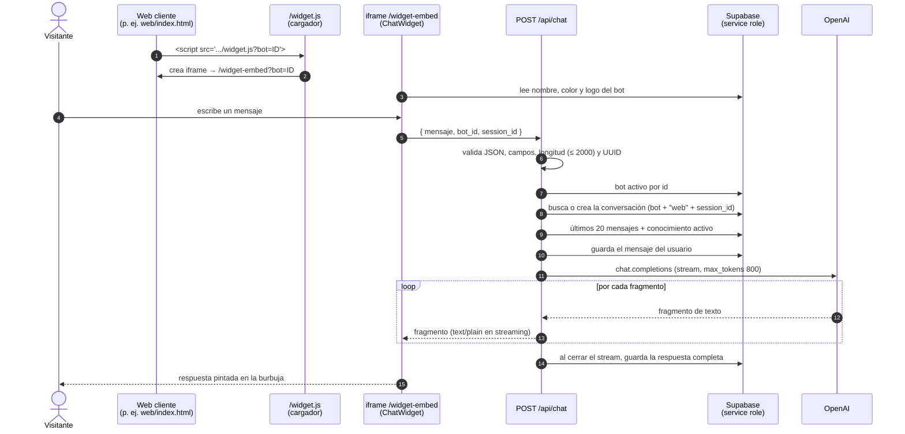
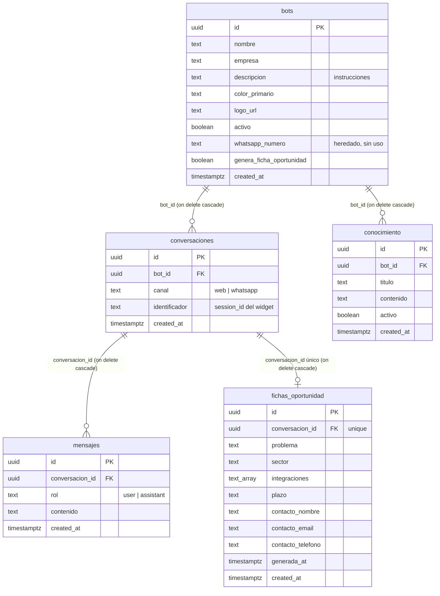

# Requisitos del producto — Kobo Assistant

**Estado:** `DRAFT` — describe el código de `main` en el commit `4928b66`
(KOBO-04 incluida).
**Preparado en:** tarea KOBO-RF.
**Fecha:** 2026-10-09.
**Para:** Manu (diseño y web) e Iñigo (desarrollo), socios de The Kobo Studio.

> **Regla de este documento:** describe lo que el sistema **hace según el
> código**, no lo que creemos que hace. Cada requisito implementado lleva su
> evidencia: un fichero con sus líneas, o el nombre de un test. Lo que no se
> puede demostrar así se marca como **no verificado** o no se afirma.
>
> Las referencias `fichero:línea` apuntan al commit indicado arriba. Si el
> código cambia, las líneas pueden moverse.

## Índice

1. [Resumen ejecutivo](#1-resumen-ejecutivo)
2. [Glosario](#2-glosario)
3. [Arquitectura](#3-arquitectura)
4. [Actores](#4-actores)
5. [Requisitos funcionales implementados](#5-requisitos-funcionales-implementados)
6. [Requisitos funcionales planificados](#6-requisitos-funcionales-planificados)
7. [Requisitos no funcionales](#7-requisitos-no-funcionales)
8. [Los dos bots de demostración](#8-los-dos-bots-de-demostración)
9. [Qué NO hace hoy](#9-qué-no-hace-hoy)
10. [Verificación manual](#10-verificación-manual)
11. [Deuda conocida y hoja de ruta](#11-deuda-conocida-y-hoja-de-ruta)

---

## 1. Resumen ejecutivo

**Qué es.** Kobo Assistant es el motor de asistentes conversacionales de The
Kobo Studio. Es **un solo programa** (Next.js + Supabase + OpenAI) que puede
hacer de muchos asistentes distintos: cada asistente ("bot") es una fila en la
base de datos con su nombre, su empresa, sus instrucciones de comportamiento y
su base de conocimiento. Cambiar de asistente es cambiar datos, no código.
Deriva de Zorion Chat; en esta versión se quitaron a propósito AimHarder,
WhatsApp/Twilio y el cron.

**Qué hace hoy (demostrable en el código):**

- Se instala en cualquier web con **una línea** `<script>` que pinta una
  burbuja de chat abajo a la derecha.
- Responde **en streaming** (el texto aparece mientras se genera) usando
  OpenAI, con las instrucciones y el conocimiento del bot elegido y los
  últimos 20 mensajes de la conversación.
- **Guarda** cada conversación y cada mensaje en Supabase.
- Lee en voz alta las respuestas (**texto a voz**).
- Tiene una **sala de demos** para cambiar de bot con un clic.
- Tiene un **panel** con login para crear y editar bots y su conocimiento,
  leer las conversaciones y, en los bots que lo tengan activado, generar una
  **ficha de oportunidad** (resumen comercial del lead) bajo demanda.

**Para quién, hoy:** para el equipo de Kobo, como **demo local** con datos
ficticios. No está preparado para estar abierto en internet (ver
[§9](#9-qué-no-hace-hoy)).

**Tres líneas de futuro:**

1. **Bea Care — doula IA para Bebeplanet.** Un acompañante para embarazadas.
   Hoy existe como *Bea doula v0*, una configuración de demostración con
   contenido general **no validado por profesionales**. La versión real exige
   validar el contenido con matronas y tratar datos de salud (categoría
   especial del art. 9 del RGPD) con las garantías adecuadas.
2. **Asistentes para pymes.** El mismo motor, configurado para una clínica,
   una peluquería o un restaurante: identidad, instrucciones y conocimiento
   del negocio. Requiere antes cerrar la deuda de seguridad y multi-tenant.
3. **El Harness como fábrica de asistentes.** A partir de una "ficha del
   cliente", generar la configuración, el conocimiento y las pruebas de un
   bot nuevo. La pieza que el Harness tendría que producir ya está aislada:
   `construirSystemPrompt` en `src/lib/bot.ts:91-108`. Hoy el Harness **no
   existe en el código**; es una línea de producto.

---

## 2. Glosario

| Término | Qué significa en este proyecto |
| --- | --- |
| **Bot** | Un asistente concreto (Kobo, Bea…). Es una fila de la tabla `bots` (`supabase/schema.sql:9-21`). |
| **Configuración de bot** | Todo lo que define a un bot: nombre, empresa, instrucciones, color, logo, si está activo y si genera ficha de oportunidad. Vive en la tabla `bots` y se edita desde el panel. |
| **Instrucciones** | El texto que dice al modelo cómo comportarse (tono, qué hace y qué no). Se guarda en la columna `bots.descripcion` y en el panel aparece como "Descripción / instrucciones del sistema" (`src/components/admin/BotForm.tsx:70-89`). |
| **Conocimiento** | Fragmentos de texto (título opcional + contenido) que el bot puede usar para responder. Tabla `conocimiento` (`supabase/schema.sql:85-92`). Solo se usan los que están `activo = true`. |
| **Conversación** | Un hilo de chat entre un visitante y un bot. Tabla `conversaciones`; se identifica por bot + canal + identificador de sesión (`src/lib/bot.ts:26-56`). |
| **Sesión** | Dos cosas distintas, ojo: (a) **sesión de chat**: un UUID que el navegador genera al cargar el widget (`src/components/chat/useChatSession.ts:12`) y que agrupa los mensajes de una conversación; (b) **sesión del panel**: el login de Supabase Auth, guardado en cookies que se borran al cerrar el navegador (`src/lib/supabase/cookies.ts:8-13`). |
| **Widget** | La burbuja de chat. Es el componente `ChatWidget` (`src/components/chat/ChatWidget.tsx`), que se monta dentro de un iframe en webs ajenas o directamente en la sala de demos. |
| **Sala de demos** | La página `/widget`: lista los bots activos y deja elegir uno (`src/app/widget/page.tsx`). |
| **Panel** | La zona `/admin`, con login, para gestionar bots, conocimiento y conversaciones. |
| **Ficha de oportunidad** | Resumen estructurado de un lead (problema, sector, integraciones, plazo, contacto) generado bajo demanda desde una conversación. Tabla `fichas_oportunidad` (`supabase/schema.sql:107-119`). Tarea KOBO-04. |
| **Tenant** | Un cliente del producto (por ejemplo, una pyme con su bot). "Multi-tenant" significa que varios clientes comparten el mismo motor sin ver los datos de los demás. Hoy no hay columna de tenant: ver [§9](#9-qué-no-hace-hoy). |
| **Service role** | La clave de Supabase con permisos totales, que **se salta RLS**. Solo existe en servidor (`SUPABASE_SERVICE_ROLE_KEY`, `src/lib/supabase/admin.ts:3-14`). Casi todo el código de servidor la usa. |
| **RLS** | *Row Level Security*: reglas de Postgres que dicen qué filas puede leer o escribir cada tipo de usuario. Están activadas en todas las tablas (`supabase/schema.sql`), pero no frenan a la service role. |
| **Server action** | Función de servidor de Next.js que el navegador invoca como si fuera local (marcada con `"use server"`). Aquí: crear/editar/borrar bots y conocimiento y generar la ficha (`src/lib/actions/`). Se pueden invocar con un POST directo, por eso deben defenderse solas. |
| **Puerto y adaptador** | Patrón de diseño: el código habla con una interfaz propia (**puerto**) y detrás hay una o varias implementaciones intercambiables (**adaptadores**). Hoy **no hay ninguno** en el código; está planificado para el rate limit (KOBO-03) y el modelo de lenguaje (KOBO-06). |
| **Seed** | Script que carga datos iniciales. Aquí `supabase/seed-demo.sql`, que crea los bots Kobo y Bea con su conocimiento. Es idempotente: se puede relanzar. |
| **Migración** | Script SQL que cambia una base ya creada para ponerla al día. Carpeta `supabase/migrations/`; hoy hay una (`20261009120000_genera_ficha_oportunidad.sql`). Una instalación nueva no la necesita porque `schema.sql` ya está al día. |

---

## 3. Arquitectura

### 3.1 Piezas

| Pieza | Qué es | Dónde |
| --- | --- | --- |
| Web cliente | Cualquier web que pegue el `<script>`. En la demo, la web de Kobo en `web/`, servida con `npm run web` en el puerto 5500. | `web/index.html:633` |
| Cargador | JavaScript que crea el iframe del widget. | `src/app/widget.js/route.ts` |
| Widget embebido | Página que pinta solo la burbuja, con fondo transparente. | `src/app/widget-embed/page.tsx` |
| API de chat | Recibe el mensaje, valida, consulta Supabase, llama a OpenAI y devuelve el texto en streaming. | `src/app/api/chat/route.ts` |
| API de voz | Convierte un texto en MP3. | `src/app/api/tts/route.ts` |
| Panel | Páginas de `/admin` y server actions. | `src/app/admin/`, `src/lib/actions/` |
| Supabase | Postgres (datos) + Auth (login del panel). | `supabase/schema.sql` |
| OpenAI | Chat (`gpt-4o` por defecto, `OPENAI_MODEL` lo cambia), ficha (mismo modelo) y voz (`tts-1`). | `src/lib/openai.ts`, `src/app/api/chat/route.ts:13`, `src/lib/fichaOportunidad.ts:14`, `src/app/api/tts/route.ts:14-19` |

### 3.2 Recorrido de un mensaje

Evidencia del orden: `src/app/api/chat/route.ts:16-102`;
cargador: `src/app/widget.js/route.ts:5-45`; lectura del bot en el iframe:
`src/app/widget-embed/page.tsx:19-25`.

### 3.3 Modelo de datos

Evidencia: `supabase/schema.sql:9-135`. Borrar un bot borra en cascada sus
conversaciones, mensajes, fichas y conocimiento.

### 3.4 Por qué un mismo motor sirve a varios bots

Porque **todo lo que identifica a un bot vive en datos, no en código**:

- El widget recibe el bot por parámetro (`?bot=ID`) y lee su nombre, color y
  logo de la base de datos (`src/app/widget-embed/page.tsx:19-35`).
- La API de chat carga el bot por su id (`src/app/api/chat/route.ts:52`), su
  conocimiento activo y su historial (`src/lib/bot.ts:110-125`).
- El *system prompt* se construye **solo** con la configuración de ese bot y su
  conocimiento; no hay texto global por cliente
  (`src/lib/bot.ts:86-108`; tests en `src/lib/bot.test.ts`, bloque
  `construirSystemPrompt`).
- Funciones opcionales, como la ficha de oportunidad, se activan con una
  columna del bot (`genera_ficha_oportunidad`), no comparando ids en el código
  (`src/lib/actions/fichaOportunidad.ts:55-57`).

Comprobación hecha para este documento: `grep -rn "6b0b0000" src` solo
encuentra el id de Kobo como dato de prueba en
`src/lib/actions/fichaOportunidad.test.ts:70`; ningún fichero de código de la
aplicación lo contiene. Fuera de `src/`, los ids de Kobo y Bea aparecen en
`supabase/seed-demo.sql`, `web/index.html` y la documentación.

Un bot nuevo = una fila en `bots` + filas en `conocimiento`. Esa es la base del
Harness: generar esas filas a partir de la ficha de un cliente.

---

## 4. Actores

| Actor | Estado | Qué puede hacer | Cómo se le reconoce |
| --- | --- | --- | --- |
| **Visitante de la web** | Implementado | Abrir la burbuja, chatear con un bot activo, escuchar respuestas en voz alta. | No se identifica. Solo lleva un `session_id` aleatorio generado en su navegador (`src/components/chat/useChatSession.ts:12`). |
| **Usuario del panel** | Implementado | Todo el panel: crear, editar y borrar bots y conocimiento; ver todas las conversaciones de todos los bots; generar fichas. | Usuario con email y contraseña en Supabase Auth (`src/app/admin/login/page.tsx:19-23`). Hoy **todos los usuarios del panel tienen los mismos permisos**: no hay roles. |
| **Administrador por rol** | Futuro (KOBO-05) | Solo él podrá crear, editar o borrar bots y conocimiento. | `app_metadata.rol === "admin"` en Supabase, comprobado dentro de cada server action. |
| **Cliente con su propio panel** | Futuro (deuda multi-tenant) | Ver y gestionar solo sus bots y sus conversaciones. | Requiere columna `tenant_id`, RLS por tenant y pruebas cross-tenant. Ver `docs/BACKLOG.md`, "Panel sin aislamiento por tenant". |
